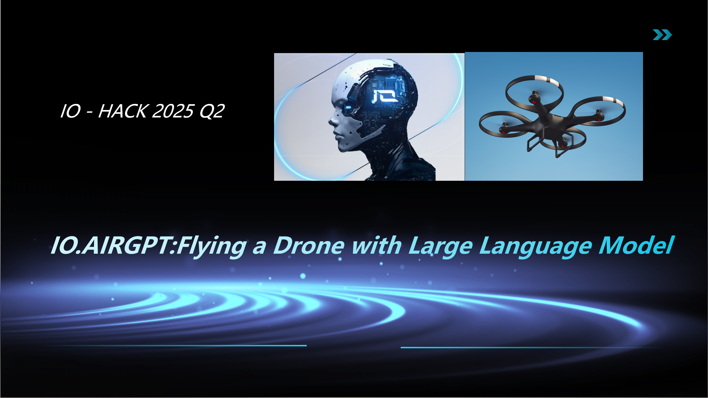
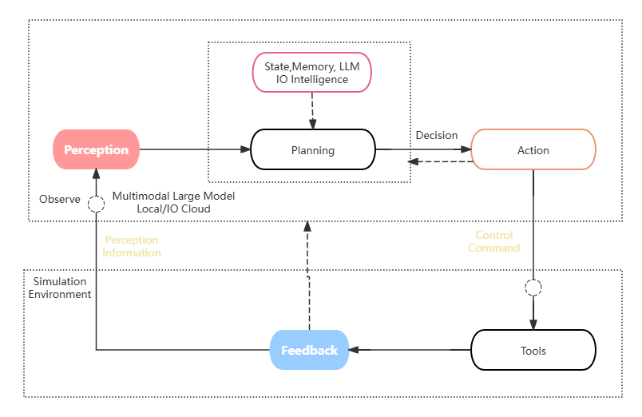
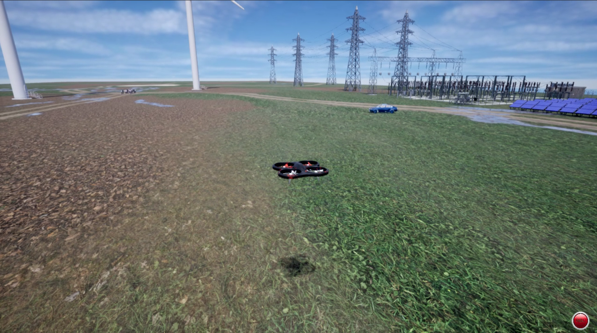
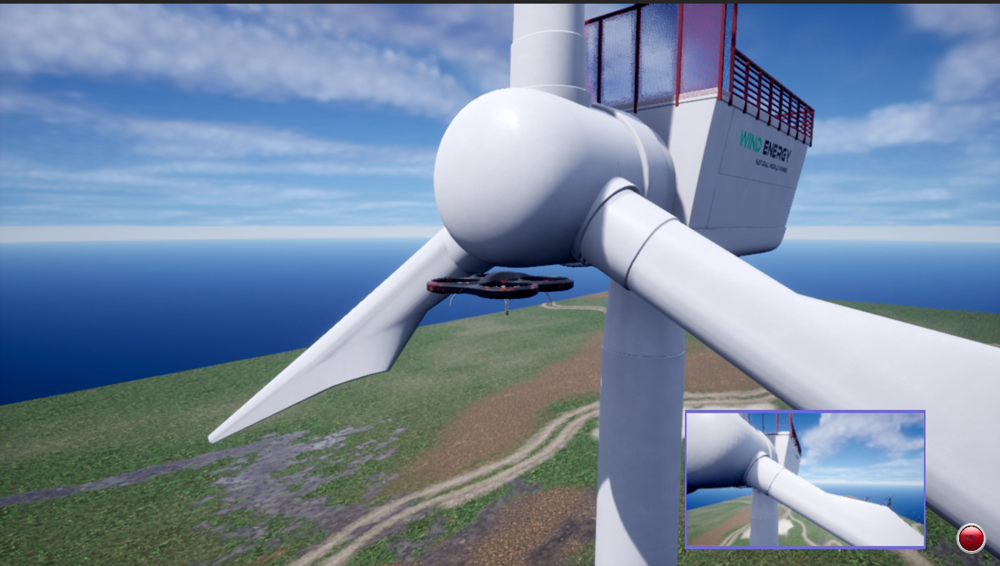
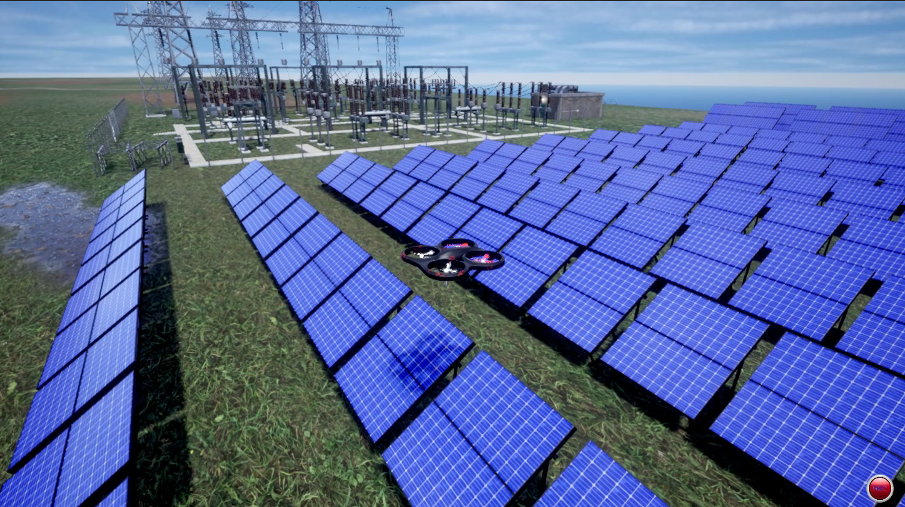
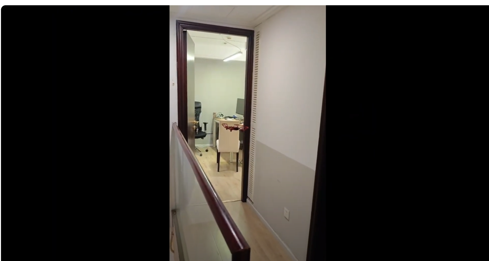
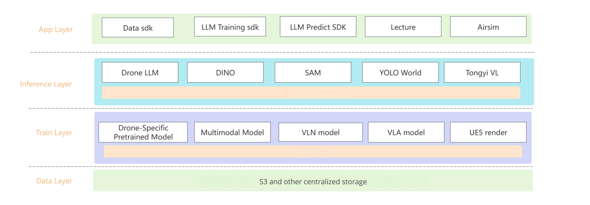
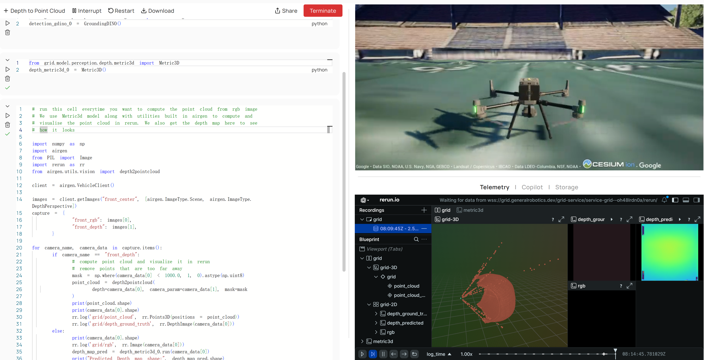

## Project Overview  
**DroneGPT-OSS: Advanced Drone Control with OpenAI's gpt-oss Reasoning Models**

**VIDEO LINK**: (10 S Demo Tello Drone)   https://www.youtube.com/watch?v=eYLP1fv5g40&t=141s

.
🏆 **Submitted to OpenAI Open Model Hackathon - "Best in Robotics" Category**

This project demonstrates the unique capabilities of **OpenAI's gpt-oss** (open-weight reasoning models) for autonomous drone control. Using natural language instructions, gpt-oss provides advanced reasoning, safety analysis, and mission planning for both simulated and real drone operations.

---

## 🧠 Why gpt-oss for Drone Control?  

**gpt-oss** brings unprecedented reasoning capabilities to robotics:
- **Advanced spatial reasoning** for complex 3D navigation
- **Multi-step mission planning** with safety considerations  
- **Real-time decision making** for dynamic environments
- **Reasoning effort control** (low/medium/high) for different scenarios

Unlike traditional LLMs, gpt-oss can **think through** complex drone missions step-by-step, considering safety margins, obstacle avoidance, and emergency protocols.

---

## Introduction to AirSim  
AirSim is an open-source drone and autonomous vehicle simulator designed to provide a high-fidelity simulation environment for research and development of drones and autonomous vehicles. Developed by Microsoft, it supports a variety of sensor simulations such as cameras and LiDAR, and can interface with multiple programming languages like Python and C++.

---

## Project Architecture  
Our project combines **gpt-oss** and **AirSim**, leveraging the powerful reasoning capabilities of open source large language models from OpenAI to enable autonomous drone flight within the AirSim environment.

The system adopts a typical **embodied intelligence framework**, where gpt-oss provides key planning, perception, and decision-making capabilities.

---

## 🚀 Project Components

### **Core gpt-oss Integration**
- `airsim_agent.py`: **OpenAI gpt-oss** reasoning engine for AirSim simulation
- `tello_agent.py`: **gpt-oss** integration for real Tello drone operations  
- `mock_airsim_wrapper.py`: Ubuntu-compatible testing wrapper
- `.env`: Secure HuggingFace token storage for gpt-oss API access

### **Drone Control Interfaces**
- `airsim_wrapper.py`: AirSim simulation interface optimized for LLM reasoning
- `tello_wrapper.py`: Real Tello EDU drone interface with safety protocols

### **Demonstration Notebooks**  
- `1-airsim_gpt_oss_env.ipynb`: gpt-oss environment setup and basic reasoning
- `2-basic_control.ipynb`: Simple drone commands with gpt-oss intelligence
- `3-complex_control.ipynb`: Advanced mission planning using gpt-oss reasoning
- `4-solar_matrix.ipynb`: Industrial inspection mission with reasoning effort control
- `5-tello_real_drone.ipynb`: Real drone flight with gpt-oss safety analysis

### **Setup**
1. Install dependencies: `pip install -r requirements.txt`
2. Get HuggingFace token with "Inference Providers" permission
3. Set `HF_TOKEN` in `.env` file  
4. Run notebooks or agent scripts

## 🎯 Hackathon Demonstration Scenarios

**Wind Turbine Inspection with gpt-oss Reasoning:**  

**Solar Panel Survey with Safety Analysis:**  

**Multi-waypoint Navigation with Obstacle Avoidance:**  

**Emergency Response Mission Planning:**  

---

## 🚀 Future Vision with gpt-oss

Building on OpenAI's gpt-oss models, we envision:
- **Swarm intelligence** using gpt-oss for coordinated multi-drone operations
- **Advanced reasoning models** fine-tuned for robotics applications  
- **Edge deployment** of gpt-oss for real-time autonomous systems
- **Safety certification** frameworks for gpt-oss in critical applications

**System Architecture for Scale:**  

**Production Deployment Vision:**  

---

## Next Steps  

In the future, we plan to:
- Implement training and deployment of drone-focused large models and inference services.
- Leverage Unreal Engine integration to run AirSim in the cloud, completing the technical loop.
- Integrate payment functionality.

Ultimately, our goal is to create a **complete drone large model learning and development platform**.

**Future System Design:**  

**Future Product Design:**  

