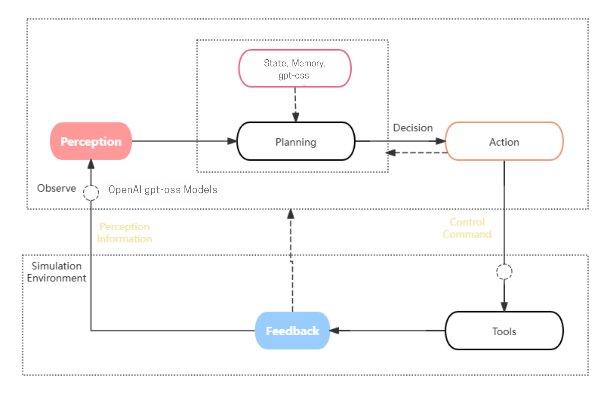
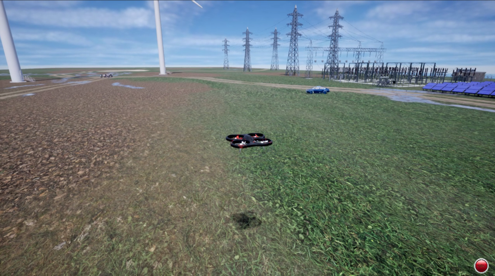
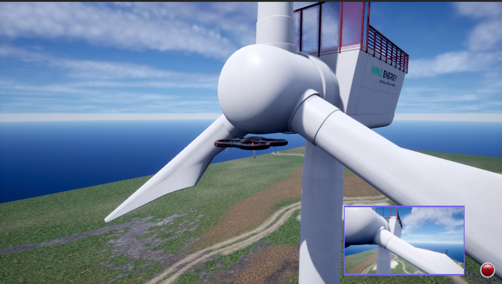

## 项目简介
项目的名称为IO.AIRGPT:Flying a Drone with Large Language Model
项目使用IO Intelligence来驱动无人机，根据自然语言指令，在airsim仿真环境中自主飞行

## io intelligence简介
ionet领先的经济学模型设计，让算力提供方闲时也能获得收益，在根本上保障了算力的性价比和服务质量，为大模型应用开发者提供了全新的选择。

## arisim 简介
AirSim是一个开源的无人机和自动驾驶汽车模拟器，旨在为无人机和自动驾驶汽车的研究和开发提供一个高保真的仿真环境。它由微软开发，支持多种传感器模拟，如相机、激光雷达等，并且可以与多种编程语言（如Python、C++）进行交互。

## 项目框架
我们的项目就是io net和Airsim的组合，利用io Intelligence强大的大模型推理能力， 驱动无人机在arisim中自主飞行

系统采样了典型的具身智能设计框架，其中IO提供了关键的规划决策和智能感知功能

## 项目运行

- 1-airsim_io_env.ipynb：项目基本环境设置，包括io和airsim
- 2-basic_control.ipynb：基础无人机控制
- 3-complex_control.ipynb：复杂无人机控制
- 4-solar_matrix.ipynb：完成的无人机任务
- airsim_agent.py： io intelligence大模型服务封装，注意填写自己的api key
- airsim_wrapper.py：airsim封装，适用于大模型调用

场景1：

场景2：

场景3：

## 下一步工作
未来会基于io的cloud服务、io intelligence服务，
实现无人机大模型的训练和模型推理服务部署，
同时结合io cloud的ue功能，实现airsim的云端运行，完成技术闭环。
并基于io token实现支付功能。 
实现完整的无人机大模型学习开发平台。

后续系统设计：

后续产品设计：

